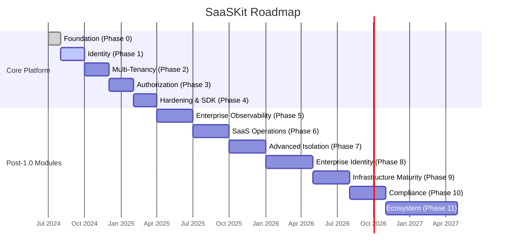

# SaaSKit — Product Roadmap

> **Vision:** The open-source operating system for SaaS applications — combining what Keycloak, Auth0, Stripe, Casbin, and Clerk each do separately, earned incrementally, module by module.

---

## Roadmap Strategy

SaaSKit follows a **core-first, modular expansion** strategy. The identity and access layer ships first and is hardened before anything else is layered on top. Every post-1.0 capability is an opt-in module that plugs into the core via defined extension points.



---

## Layered Architecture

Each layer builds on the one below it. Developers can adopt only the layers they need.

```
┌─────────────────────────────────────────────────────────────────┐
│  Layer 5 — Enterprise                                          │
│  SAML · SCIM · LDAP · Provisioning · Branding · Advanced IAM   │
├─────────────────────────────────────────────────────────────────┤
│  Layer 4 — Developer Experience                                │
│  Go SDK · TypeScript SDK · CLI · OpenAPI · Terraform Provider  │
├─────────────────────────────────────────────────────────────────┤
│  Layer 3 — Platform                                            │
│  Organizations · RBAC · API Keys · Audit · Webhooks · Billing  │
├─────────────────────────────────────────────────────────────────┤
│  Layer 2 — Identity                                            │
│  Users · Auth · Sessions · OIDC Provider · OAuth Federation    │
│  MFA · Passkeys · Password Policies · Device Trust             │
├─────────────────────────────────────────────────────────────────┤
│  Layer 1 — Core Platform                                       │
│  Config · Database · Migrations · Events · Jobs · Telemetry    │
│  Envelope Encryption · Key Management · Feature Flags          │
└─────────────────────────────────────────────────────────────────┘
```

---

## Phase 0 — Foundation ✅

**Status:** Complete · **Timeline:** Month 1 · **Release:** internal

The project scaffold, build system, database schema, and core platform services.

| Deliverable | Status | Notes |
|-------------|--------|-------|
| Go project scaffold | ✅ | chi, pgx, sqlc, koanf, slog |
| PostgreSQL schema (10 migrations) | ✅ | Users, sessions, OIDC, tokens, audit, MFA (reserved) |
| Configuration system (koanf) | ✅ | Env vars + YAML, production validation |
| Connection pool (pgx) | ✅ | Health check, configurable pool |
| Envelope encryption (AES-256-GCM) | ✅ | HKDF key derivation, context separation |
| Event publisher interface | ✅ | Log, Multi, Noop implementations |
| Background job scheduler | ✅ | Ticker-based, graceful shutdown |
| Docker Compose + Dockerfiles | ✅ | PostgreSQL 16, multi-stage production build |
| CI pipeline (GitHub Actions) | ✅ | Lint, test, build |
| ADRs | ✅ | sqlc, asymmetric JWT, koanf, zitadel/oidc |
| Apache 2.0 license | ✅ | — |

---

## Phase 1 — Identity ✅

**Status:** Core complete · **Timeline:** Months 2–3 · **Release:** `v0.1.0`

Complete identity management: authentication, sessions, OIDC, social login.

| Deliverable | Status | Notes |
|-------------|--------|-------|
| User domain model (6-state lifecycle) | ✅ | active, disabled, locked, pending, invited, deleted |
| Argon2id password hashing | ✅ | PHC format, configurable params |
| JWT key management (RS256/ES256/EdDSA) | ✅ | Auto-gen in dev, fail in prod |
| HMAC token hashing | ✅ | Server-secret-bound, not raw SHA-256 |
| Auth service (register/login/refresh/logout) | ✅ | Refresh token rotation |
| Password reset flow | ✅ | Generic identity token system |
| Email verification flow | ✅ | Generic identity token system |
| User profile CRUD | ✅ | Soft delete support |
| Session management | ✅ | List, revoke, cleanup job |
| HTTP API + middleware | ✅ | JWT auth, CORS, request logging |
| OIDC Discovery endpoint | ✅ | `/.well-known/openid-configuration` |
| IdentityManager orchestrator | ✅ | Ready for MFA/WebAuthn extension |
| Audit event publisher | ✅ | Logs all identity operations |
| Unit tests (16 passing) | ✅ | Race detection enabled |
| OIDC Provider (zitadel/oidc) | ✅ | Full `op.Storage` impl, authorization code + PKCE |
| Social login (Google, GitHub) | ✅ | OAuth2 relying party with CSRF protection |
| Login/consent UI (Go templates) | ✅ | Dark-themed, production-replaceable |
| CreateSessionForUser (social login) | ✅ | Passwordless session for federated users |
| OIDC client queries (sqlc) | ✅ | CRUD for `oidc_clients` table |
| Identity provider queries (sqlc) | ✅ | CRUD for `identity_providers` + `external_accounts` |
| Integration tests | ✅ | Real PostgreSQL |
| Docker compose smoke test | ✅ | End-to-end flow |

### API Endpoints (Phase 1)

```
POST   /api/v1/auth/register          Register
POST   /api/v1/auth/login             Login
POST   /api/v1/auth/refresh           Refresh tokens
POST   /api/v1/auth/logout            Logout (auth required)
POST   /api/v1/auth/forgot-password   Request password reset
POST   /api/v1/auth/reset-password    Execute password reset
POST   /api/v1/auth/verify-email      Verify email
GET    /api/v1/users/me               Current user (auth required)
PATCH  /api/v1/users/me               Update profile (auth required)
GET    /api/v1/users/me/sessions      List sessions (auth required)
DELETE /api/v1/users/me/sessions/{id} Revoke session (auth required)

GET    /.well-known/openid-configuration   OIDC Discovery
GET    /oidc/keys                          JWKS
GET    /oauth2/{provider}/login            Social login initiation
GET    /oauth2/{provider}/callback         Social login callback

GET    /health                             Liveness
GET    /ready                              Readiness (DB check)
```

---

## Phase 2 — Multi-Tenancy ✅

**Status:** Completed · **Release:** `v0.2.0`

Organizations and shared-database tenant isolation.

| Deliverable | Notes |
|-------------|-------|
| Tenant domain model | ID, name, slug, status, plan (reserved) |
| Organization CRUD | Create, update, disable, delete |
| User ↔ Tenant membership | Join, leave, switch |
| Multi-org membership per user | Users belong to multiple orgs |
| User invitations | Invite by email, accept/reject flow |
| Tenant context middleware | Extract `tenant_id` from JWT, set PostgreSQL session variable |
| Tenant-scoped queries | Enforce `tenant_id` filtering across all repositories |
| Feature flag tenant overrides | Per-tenant feature flag table |
| Tenant-scoped audit logs | Audit logs filtered by tenant |

### Database Tables (Phase 2)

```sql
tenants (id, name, slug, plan, status, created_at, updated_at)
tenant_members (tenant_id, user_id, role, joined_at)
tenant_invitations (tenant_id, email, role, token_hash, expires_at, accepted_at)
tenant_feature_flags (tenant_id, feature_flag_id, enabled)
```

### API Endpoints (Phase 2)

```
POST   /api/v1/tenants                    Create organization
GET    /api/v1/tenants                    List user's organizations
GET    /api/v1/tenants/{id}               Get organization
PATCH  /api/v1/tenants/{id}               Update organization
POST   /api/v1/tenants/{id}/members       Invite member
GET    /api/v1/tenants/{id}/members       List members
DELETE /api/v1/tenants/{id}/members/{uid} Remove member
POST   /api/v1/tenants/switch             Switch active organization
```

---

## Phase 3 — Authorization ⬜

**Status:** Not started · **Timeline:** Months 5–6 · **Release:** `v0.3.0`

RBAC engine with fixed role set and permission middleware.

| Deliverable | Notes |
|-------------|-------|
| Role model | Owner, Admin, Manager, Member, Viewer |
| Permission model | Resource-action format (`project.read`, `users.create`) |
| Role-permission mapping | Configurable via YAML or API |
| Permission middleware | `RequirePermission("project.delete")` |
| Tenant-scoped roles | Roles are per-tenant, not global |
| Role assignment API | Assign/revoke roles for tenant members |
| Permission checking service | Check if user has permission in tenant context |
| Docker + Helm deployment support | Kubernetes-ready |

### Database Tables (Phase 3)

```sql
roles (id, tenant_id, name, description, is_system)
permissions (id, resource, action, description)
role_permissions (role_id, permission_id)
tenant_member_roles (tenant_member_id, role_id)
```

### Middleware Example

```go
r.With(rbac.RequirePermission("project.delete")).Delete("/projects/{id}", handler)
```

---

## Phase 4 — Hardening & SDK ⬜

**Status:** Not started · **Timeline:** Months 6–7 · **Release:** `v1.0.0` 🎉

Security audit, SDK finalization, documentation, and load testing.

| Deliverable | Notes |
|-------------|-------|
| Security review / threat model | Release gate — must pass before v1.0 |
| Go SDK | `saaskit-go` — typed client for all APIs |
| TypeScript/JavaScript SDK | `saaskit-js` — typed client for frontend/Node |
| OpenAPI specification | Auto-generated from handlers |
| API versioning policy | Documented backward compatibility guarantee |
| Load testing | 1,000 tenants, 100,000 users, sub-100ms p95 |
| Documentation site | Architecture, guides, API reference |
| v1.0.0 GA release | — |

### SDK Example

```typescript
const saaskit = new SaaSKit({ baseUrl: "https://auth.example.com" });

const { user, tokens } = await saaskit.auth.register({
  email: "user@example.com",
  password: "SecurePass123!",
  name: "Jane Doe",
});

const tenant = await saaskit.tenants.create({ name: "Acme Corp" });
```

---

## Phase 5 — Enterprise Observability ⬜

**Status:** Not started · **Timeline:** Months 8–10 · **Release:** `v1.2.0`

### Module: Audit Logs (Enhanced)

Upgrade from event-based logging to a full audit system with search, export, and retention.

| Feature | Notes |
|---------|-------|
| Full-text search on audit logs | Filter by actor, target, event, tenant, date range |
| Audit log export (CSV, JSON) | Compliance reporting |
| Retention policies | Auto-purge after configurable period |
| Compliance report generation | SOC2-style audit trail summaries |
| Webhook notifications for events | Real-time audit streaming |

### Module: API Key Management

| Feature | Notes |
|---------|-------|
| API key CRUD | Create, list, revoke |
| Key format: `sk_live_xxxxxx` | Prefix-based for easy identification |
| Scoped permissions | Keys inherit a subset of user permissions |
| Expiration and rotation | TTL, manual rotation |
| Rate limiting per key | Configurable per-key limits |
| Key hashing | Only hash stored, prefix shown in UI |

```json
{
  "key": "sk_live_abc123...",
  "name": "Production API",
  "scopes": ["project.read", "project.update"],
  "expires_at": "2025-12-31T23:59:59Z"
}
```

---

## Phase 6 — SaaS Operations ⬜

**Status:** Not started · **Timeline:** Months 10–13 · **Release:** `v1.5.0`

### Module: Usage Tracking

| Feature | Notes |
|---------|-------|
| Track API calls per tenant | Counter-based metering |
| Track storage usage | Per-tenant storage quotas |
| Track user count per tenant | Plan limit enforcement |
| Usage dashboard API | Expose metrics for admin UIs |
| Usage export | CSV/JSON for billing integration |

### Module: Billing Integration

> **Philosophy:** SaaSKit is a thin webhook/event relay layer, not an opinionated billing engine. Pricing logic belongs in the host application.

| Feature | Notes |
|---------|-------|
| Stripe adapter | Webhook ingestion, subscription sync |
| Paddle adapter | — |
| Lemon Squeezy adapter | — |
| Subscription lifecycle events | `created`, `updated`, `cancelled`, `payment.failed` |
| Plan ↔ feature flag mapping | Enable features based on subscription plan |
| Webhook signature verification | Secure ingestion |

---

## Phase 7 — Advanced Isolation ⬜

**Status:** Not started · **Timeline:** Year 2, Q1 · **Release:** `v1.7.0`

| Feature | Notes |
|---------|-------|
| Schema-per-tenant isolation | `tenant_a.users` |
| Database-per-tenant isolation | Dedicated database instances |
| Migration tooling | Move tenants between isolation modes without downtime |
| Connection routing | Automatic routing based on tenant config |
| Performance benchmarks | Compare isolation modes |

---

## Phase 8 — Enterprise Identity & Access ⬜

**Status:** Not started · **Timeline:** Year 2, Q2–Q3 · **Release:** `v2.0.0`

### Identity

| Feature | Notes |
|---------|-------|
| MFA (TOTP) | Tables already reserved in Phase 0 |
| WebAuthn / Passkeys | FIDO2 support |
| SAML SSO | Enterprise IdP federation |
| SCIM 2.0 provisioning | Directory sync (Azure AD, Okta) |
| LDAP integration | Enterprise directory lookup |
| Adaptive MFA | Risk-based MFA challenges |
| Password policies | Complexity, history, expiry |
| Device trust | Trusted device management |

### Authorization

| Feature | Notes |
|---------|-------|
| ABAC policy engine | Attribute-based access control |
| Relationship-based permissions | Zanzibar/OpenFGA-style |
| Policy language | `user.department == project.department` |
| Policy evaluation engine | Build in-house or embed Casbin/OpenFGA |

---

## Phase 9 — Infrastructure Maturity ⬜

**Status:** Not started · **Timeline:** Year 2, Q4 · **Release:** `v2.2.0`

| Feature | Notes |
|---------|-------|
| Multi-region deployment | Geographic redundancy |
| High availability | Active-active or active-passive |
| Backup / restore system | Point-in-time recovery |
| OpenTelemetry integration | Traces, metrics, structured logs |
| Scale targets | 10,000 tenants, 1M users, 100M audit events |
| Connection pooling (PgBouncer) | Production-grade DB connection management |

---

## Phase 10 — Compliance ⬜

**Status:** Not started · **Timeline:** Year 2, Q4+ · **Release:** `v2.5.0`

| Feature | Notes |
|---------|-------|
| GDPR data export | User data portability |
| Right-to-erasure workflows | Automated data deletion with audit trail |
| SOC2 report generation | Audit evidence collection |
| Data residency controls | Tenant data pinned to specific regions |
| Consent management | Cookie consent, privacy preferences |
| Data classification | Tag sensitive fields |

---

## Phase 11 — Ecosystem ⬜

**Status:** Not started · **Timeline:** Year 3 · **Release:** `v3.0.0`

### Admin Dashboard

```
/admin
  ├── Users          — search, create, disable, impersonate
  ├── Tenants        — manage organizations, plans
  ├── Security       — active sessions, MFA enrollment
  ├── Usage          — API calls, storage, quotas
  ├── Billing        — subscriptions, invoices
  ├── Logs           — audit trail, event stream
  └── Settings       — OIDC clients, IdPs, feature flags
```

### Plugin Marketplace

| Plugin Type | Examples |
|------------|---------|
| Billing | Stripe, Paddle, LemonSqueezy |
| CRM | Salesforce, HubSpot |
| Analytics | Mixpanel, Amplitude, PostHog |
| Communication | SendGrid, Twilio, Resend |
| Storage | S3, GCS, MinIO |
| Search | Elasticsearch, Meilisearch |

### Developer CLI

```bash
saaskit init                          # Initialize new SaaSKit project
saaskit generate model Invoice        # Generate domain model
saaskit generate migration add_foo    # Create migration
saaskit migrate up                    # Run migrations
saaskit create-service billing        # Scaffold a new service module
saaskit tenant list                   # List tenants
saaskit user create --email=...       # Create user from CLI
```

### Terraform Provider

```hcl
resource "saaskit_tenant" "acme" {
  name = "Acme Corp"
  slug = "acme"
  plan = "enterprise"
}

resource "saaskit_oidc_client" "web_app" {
  client_name   = "Web Application"
  redirect_uris = ["https://app.acme.com/callback"]
  grant_types   = ["authorization_code"]
  pkce_required = true
}
```

---

## Open Design Decisions

These need product decisions before the relevant phase starts:

| # | Question | Affects | Recommendation |
|---|----------|---------|---------------|
| 1 | **Billing philosophy** — dictate plan/feature schema or relay provider webhooks? | Phase 6 | Relay layer (avoid becoming a billing product) |
| 2 | **ABAC engine** — build in-house vs. embed OpenFGA/Casbin? | Phase 8 | Evaluate both; likely OpenFGA adapter |
| 3 | **Tenant isolation migration** — how to move between modes without downtime? | Phase 7 | Needs dedicated design doc |
| 4 | **API versioning policy** — how to handle breaking changes? | Phase 4 | Semantic versioning + deprecation headers |
| 5 | **Governance model** — contributor guidelines, RFC process? | Phase 5+ | Establish before accepting external modules |
| 6 | **Open-core boundary** — what stays open vs. commercial? | All | Decide before v1.0 to avoid community friction |
| 7 | **UUID v4 vs v7/ULID** — ordered IDs for index optimization? | Phase 7+ | Evaluate when hitting scale targets |
| 8 | **PostgreSQL RLS** — row-level security for tenant isolation? | Phase 2 | Design repos to be RLS-compatible |

---

## Performance Targets

| Milestone | Tenants | Users | Audit Events | Auth p95 |
|-----------|---------|-------|-------------|----------|
| **v1.0** | 1,000 | 100,000 | — | < 100ms |
| **v2.0** | 10,000 | 1,000,000 | 100,000,000 | < 50ms |
| **v3.0** | 100,000 | 10,000,000 | 1,000,000,000 | < 25ms |

---

## Team Size Estimates

| Phase | Scope | Team Size | Duration |
|-------|-------|-----------|----------|
| v1.0 (Phases 0–4) | Identity + Tenancy + RBAC | 2–5 engineers | ~7 months |
| v1.5 (Phases 5–6) | Audit + API Keys + Billing | 3–5 engineers | ~6 months |
| v2.0 (Phases 7–8) | Enterprise Identity + Isolation | 5–8 engineers | ~8 months |
| v3.0 (Phases 9–11) | Scale + Compliance + Ecosystem | 8–15 engineers | ~12 months |

---

## Positioning

**v1.0:** *"The open-source, tenancy-native identity and access foundation for SaaS apps"* — direct alternative to Keycloak, narrower than Auth0/Clerk in surface area but deeper on multi-tenancy out of the box.

**v2.0+:** *"The open-source operating system for SaaS applications"* — combining what Keycloak, Stripe, Auth0, Casbin, and Clerk each do separately — but earned incrementally, module by module, on top of a core that's already trusted in production.
